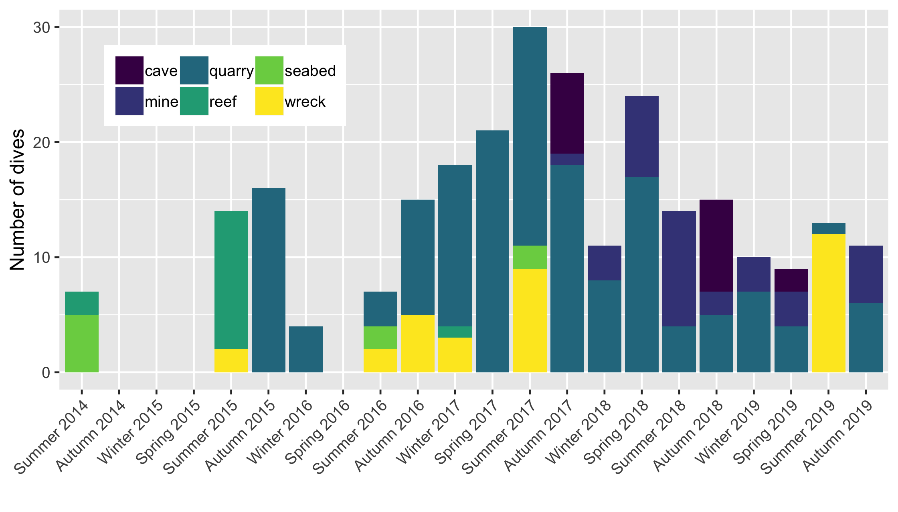
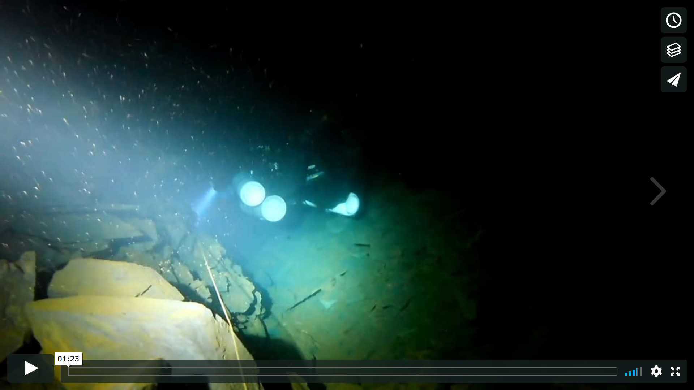

___
## Diving summary
___

___
## Media
___

___
## Diving qualifications
___

### RAID Deco 50 (May 2018)

### RAID Cave 1 (December 2018)

### BSAC Sports Diver (crossover) (February 2017)

### RAID Sidemount (September 2016)

### PADI Rescue Diver (March 2016)

### PADI Advanced Open Water (August 2015)

### PADI Open Water (September 2014)

___
## Membership
___

### UKMC (2018 - present)

UK Mine / Cave diving and exploration
[Website](http://www.ukmine-cave.com/)

### SUSAC (2017 - present)

Sheffield University Sub Aqua Club - BSAC
[Website](http://www.susac.com/)