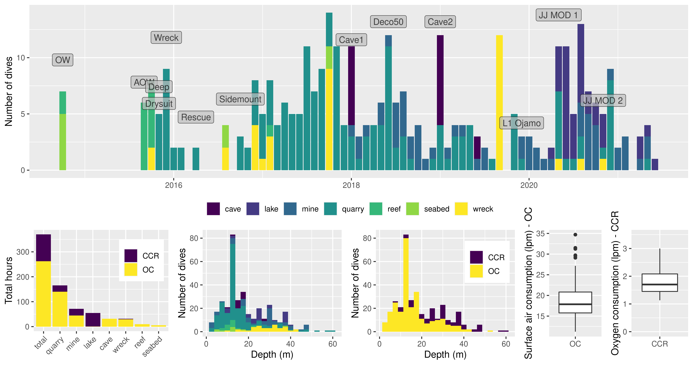

## Diving summary
___

I started diving in late 2014 whilst on holiday in Singapore. At the time I had just completed my undergraduate degree 
in Sheffield, throughout which I had cultivated a strong interest in ancient DNA and human evolution. In pursuing this 
interest I came across a recently published paper by Chatters et al. (2014) that had analysed ancient mitochondrial DNA
recovered from a ~12,000 year old skeleton at a depth of over 40m inside the Sac Actun cave system in Quintana Roo, 
Mexico (the paper: <https://science.sciencemag.org/content/344/6185/750.full>). Although the results were not accepted
by all, they sparked my interest in cave diving, and led to me signing up for my open water course, with a view to 
working towards more technical diving. Something that is still a work in progress and illustrated in the figure
below. 

## Diving clips
___

A video by my cave instructor Garry Dallas, from a dive in Cueva del Agua in Isla Plana, Spain after I had completed
my Cave 2 course.  



A video I put together from a dive in Aber Las mine in Wales.  

  
A video by Mark Lovatt of a dive in Dinas Silica in South Wales  


Another video from Mark Lovatt, showing a dive in in Croesor Mine in Wales, I think my favourite mine to date. 


## Diving qualifications
___

| Course | Instructor | Agency | Facility | Date |
|:-------|:----------:|:--------:|:----:|-----:|
| JJ-CCR MOD 1 | Pasi Lammi | RAID | | April 2020 |
| Cave 2 | Garry Dallas | RAID | [Simply Tec and Sidemount](http://www.simplysidemount.com/) | December 2018 |
| Deco 50 | Garry Dallas | RAID | [Simply Tec and Sidemount](http://www.simplysidemount.com/) | May 2018 |
| Cave 1 | Garry Dallas | RAID | [Simply Tec and Sidemount](http://www.simplysidemount.com/) | December 2017 | 
| Nitrox Diver | | BSAC | [SUSAC](http://www.susac.com/) | May 2017 | 
| Sports Diver (crossover) | | BSAC | [SUSAC](http://www.susac.com/) | February 2017 |
| Sidemount |  Garry Dallas | RAID | [Simply Tec and Sidemount](http://www.simplysidemount.com/) | September 2016 |
| Rescue Diver | Steven Hird | PADI | [Diveworld](https://www.learn2dive.co.uk/) | March 2016 |
| Advanced Open Water | Julius Orongan | PADI | [GS-Diving](https://www.gs-diving.com/) | August 2015 |
| Open Water | George Lee | PADI | [Gill Divers](https://www.gilldivers.com/) | September 2014 |

## Membership
___

### UKMC (2018 - present)

UK Mine / Cave diving and exploration
[Website](http://www.ukmine-cave.com/)

### SUSAC (2017 - present)

Sheffield University Sub Aqua Club - BSAC
[Website](http://www.susac.com/)