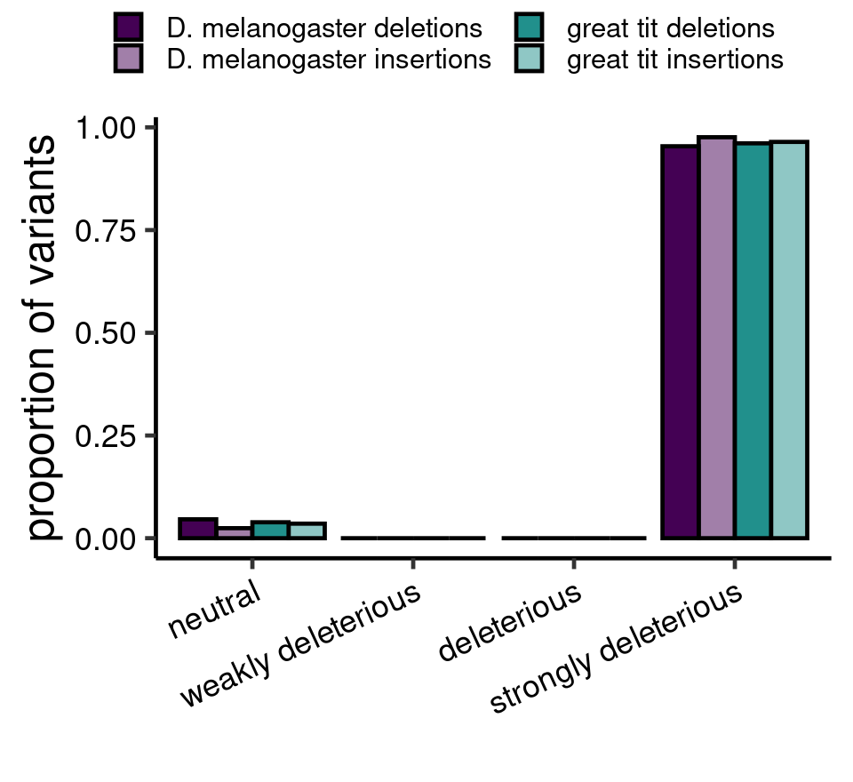
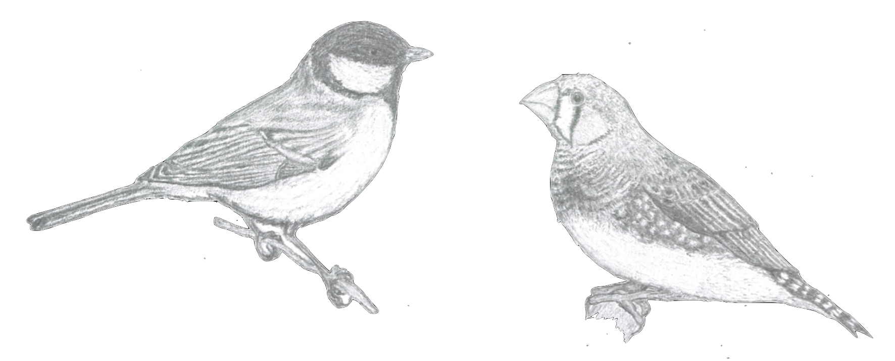

## Population genetics of Atlantic salmon

I am currently using a mix of whole genome re-sequencing data and forward simulations to address evolutionary and 
population genetic questions in a population of Atlantic salmon from the Teno/Tana river in northern Finland/Norway.

 

## Fitness effects of short insertions and deletions

 
I am interested in the impact of short insertions and deletions (INDELs) in the genome. 
After single nucleotide polymorphisms (SNPs) INDELs are the most common source of variation, and thus represent a 
large amount of material on which selection can act. They are, however, often filtered out in analyses. 
In my work I leverage the site frequency spectrum (SFS), that is, the distribution of allele frequencies, to infer the 
strength of selection acting on INDELs in different contexts and species. For example 
the figure on the right shows the proportion of strongly deleterious and neutral INDELs in coding regions in 
<i>Drosophila melanogaster</i> and the great tit.

  

## GC biased gene conversion

 
During recombination double stranded breaks occur along the genome. These subsequently need repairing, during this repair
process any missing sequence is replicated using an existing strand as a template. However, this can generate a stretch
of DNA where each strand of the molecule comes from a different parental chromosome, this is problematic when this 
region encompasses SNPs, as the two bases may be mismatched. These mismatches are resolved by converting one of the bases
to fit its partner, a process called gene conversion. However, the process is biased, whereby it is more likely to keep
G and C bases and change A and T bases, than the other way round, hence it is referred to as GC biased gene conversion 
(gBGC). Consequently, gBGC elevates the frequencies of GC alleles in the genome in a manner similar to positive selection,
and can increase the GC content of the genome, particularly in highly recombining regions. In my work I am comparing 
the strength of gBGC between two birds, the zebra finch and the great tit, and seeing how gBGC varies within their genomes.

